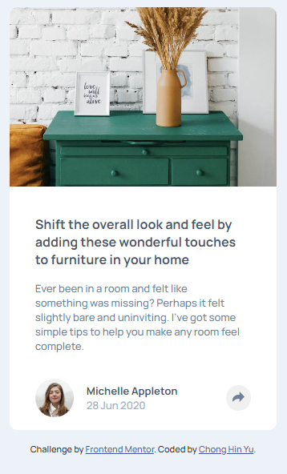
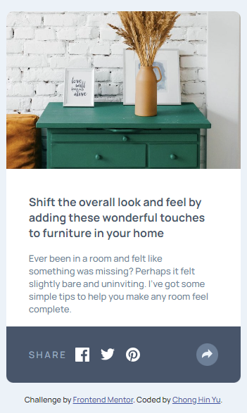

# Frontend Mentor - Article preview component solution

This is a solution to the [Article preview component challenge on Frontend Mentor](https://www.frontendmentor.io/challenges/article-preview-component-dYBN_pYFT). Frontend Mentor challenges help you improve your coding skills by building realistic projects.

## Overview

Completed the Article preview component challenge using HTML,CSS and JavaScript.

I used Flexbox for the layouts of the page with a mobile first approach and media queries to handle the desktop layout.

The mobile and desktop have a different design when clicking on the share icon to see the social media links.

### The challenge

Users should be able to:

- View the optimal layout for the component depending on their device's screen size
- See the social media share links when they click the share icon

### Screenshot

Mobile layout

Mobile layout Share icon clicked

Desktop layout

Mobile layout Share icon clicked

### Links

- Live Site URL: [Article preview component](https://hin274.github.io/article-preview-component-master/)

## Author

- Frontend Mentor - @hin274
